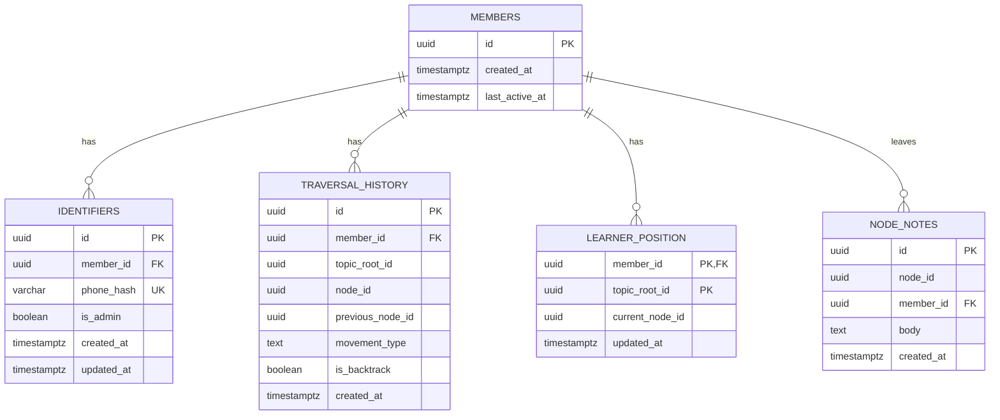

# Knowledge Graph Learning System

## Overview

Build a learning system where knowledge graphs are generated on-demand by AI and grow through learner traversal. A learner expresses an interest (e.g. "Bansuri"), the AI proposes a starting node, and from there the learner navigates a graph of concepts — choosing between meaningful next steps tagged with "movements of learning." The graph persists in Memgraph and grows organically as people learn. Everyone interested in the same topic shares the same graph.

This is a clean-slate implementation replacing the previous linear curriculum model. The existing Postgres schema (`migrations/001_initial.sql`) and config (`config/learning.toml`) reflect the old model and will be replaced.

## Problem Statement / Motivation

Traditional learning tools force content into linear sequences or rigid difficulty buckets (beginner/intermediate/advanced). Learning is actually a gradient — a graph with many dimensions. This system models learning as graph traversal, where the learner is always at a node and always being offered meaningful directions to go next. The graph gets smarter over time through collective traversal patterns.

## Technical Approach

### Architecture

Polyglot persistence with three layers:

```
┌─────────────────────────────────────────────┐
│              React SPA (Vite)                │
│          (TypeScript, single page)           │
└──────────────────┬──────────────────────────┘
                   │ GraphQL (POST /graphql)
┌──────────────────▼──────────────────────────┐
│          Axum + async-graphql Server         │
│         (learning-server, port 3000)         │
├──────────────────────────────────────────────┤
│             learning-core                    │
│   (domain models, traits, graph logic)       │
├─────────────┬────────────────┬───────────────┤
│  Memgraph   │   Postgres     │   AI Client   │
│  (graph)    │  (sessions)    │  (proposals)   │
└─────────────┴────────────────┴───────────────┘
```

| Concern | Store | Rationale |
|---|---|---|
| Knowledge graph (nodes, edges, weights) | Memgraph | In-memory graph DB, Bolt-compatible, native Cypher, fast traversal |
| Embeddings (node + topic vectors) | Memgraph | Native vector indexes (HNSW via USearch), combined with graph queries |
| Learner sessions, traversal history | Postgres | Relational, time-series, simple queries |
| AI proposal generation | ai-client module | Already built, supports Claude/OpenAI/OpenRouter |

**Why Memgraph over Neo4j:**
- In-memory first — faster traversal and query performance
- Bolt protocol compatible — `neo4rs` crate works out of the box
- OpenCypher compatible — same query language
- Native vector search (HNSW) with single-store index (3.8+) — 85% less memory overhead
- Lighter Docker footprint

### Data Model

#### Memgraph Schema (Cypher)

```cypher
// Node: a learning concept/topic
(:Node {
  id: "uuid",
  title: "Breath Control",
  description: "Fundamental technique for sustained notes...",
  topic_root_id: "uuid",        // which topic graph this belongs to
  embedding: [float],            // 1536-dim vector for dedup + matching
  visit_count: 0,                // total visits across all learners
  created_at: "2026-02-16T..."
})

// Topic Root: entry point for a topic graph
(:TopicRoot {
  id: "uuid",
  name: "Bansuri",
  description: "Indian bamboo flute",
  embedding: [float],            // for matching "Indian flute" -> Bansuri
  created_at: "2026-02-16T..."
})

// Edges: movements of learning (five relationship types)
(:Node)-[:SUPPORTS {weight: 0.0, traversals: 0, backups: 0}]->(:Node)
(:Node)-[:DEEPENS {weight: 0.0, traversals: 0, backups: 0}]->(:Node)
(:Node)-[:RELATES_TO {weight: 0.0, traversals: 0, backups: 0}]->(:Node)
(:Node)-[:APPLIES {weight: 0.0, traversals: 0, backups: 0}]->(:Node)
(:Node)-[:CONTEXTUALIZES {weight: 0.0, traversals: 0, backups: 0}]->(:Node)

// Entry edge from topic root to first node(s)
(:TopicRoot)-[:STARTS_WITH]->(:Node)

// Indexes + Constraints
CREATE CONSTRAINT ON (n:Node) ASSERT n.id IS UNIQUE;
CREATE CONSTRAINT ON (t:TopicRoot) ASSERT t.id IS UNIQUE;
CREATE INDEX ON :Node(topic_root_id);

// Vector indexes (Memgraph syntax)
CREATE VECTOR INDEX ON :Node(embedding) WITH CONFIG {"dimension": 1536, "metric": "cos"};
CREATE VECTOR INDEX ON :TopicRoot(embedding) WITH CONFIG {"dimension": 1536, "metric": "cos"};
```

#### Postgres Schema (replaces `001_initial.sql`)

```sql
-- Members (learner accounts, no PII stored)
CREATE TABLE members (
  id UUID PRIMARY KEY DEFAULT gen_random_uuid(),
  created_at TIMESTAMPTZ NOT NULL DEFAULT now(),
  last_active_at TIMESTAMPTZ NOT NULL DEFAULT now()
);

-- Identifiers (hashed phone numbers → members)
-- Following mntogether pattern: phone numbers are SHA256 hashed, never stored raw
CREATE TABLE identifiers (
  id UUID PRIMARY KEY DEFAULT gen_random_uuid(),
  member_id UUID NOT NULL REFERENCES members(id) ON DELETE CASCADE,
  phone_hash VARCHAR(64) NOT NULL UNIQUE,  -- SHA256 hash of phone number
  is_admin BOOLEAN NOT NULL DEFAULT false,
  created_at TIMESTAMPTZ NOT NULL DEFAULT now(),
  updated_at TIMESTAMPTZ NOT NULL DEFAULT now()
);

CREATE INDEX idx_identifiers_phone_hash ON identifiers(phone_hash);
CREATE INDEX idx_identifiers_member_id ON identifiers(member_id);

-- Traversal history per member per topic
CREATE TABLE traversal_history (
  id UUID PRIMARY KEY DEFAULT gen_random_uuid(),
  member_id UUID NOT NULL REFERENCES members(id),
  topic_root_id UUID NOT NULL,          -- matches Memgraph TopicRoot.id
  node_id UUID NOT NULL,                -- matches Memgraph Node.id
  previous_node_id UUID,                -- null for first node
  movement_type TEXT,                   -- SUPPORTS, DEEPENS, RELATES_TO, APPLIES, CONTEXTUALIZES
  is_backtrack BOOLEAN NOT NULL DEFAULT false,
  created_at TIMESTAMPTZ NOT NULL DEFAULT now()
);

CREATE INDEX idx_traversal_member ON traversal_history(member_id, topic_root_id);
CREATE INDEX idx_traversal_node ON traversal_history(node_id);

-- Active position per member per topic
CREATE TABLE learner_position (
  member_id UUID NOT NULL REFERENCES members(id),
  topic_root_id UUID NOT NULL,
  current_node_id UUID NOT NULL,
  updated_at TIMESTAMPTZ NOT NULL DEFAULT now(),
  PRIMARY KEY (member_id, topic_root_id)
);

-- Notes left by learners on nodes (trail markers)
CREATE TABLE node_notes (
  id UUID PRIMARY KEY DEFAULT gen_random_uuid(),
  node_id UUID NOT NULL,                -- matches Memgraph Node.id
  member_id UUID NOT NULL REFERENCES members(id),
  body TEXT NOT NULL,
  created_at TIMESTAMPTZ NOT NULL DEFAULT now()
);

CREATE INDEX idx_node_notes_node ON node_notes(node_id);
CREATE INDEX idx_node_notes_member ON node_notes(member_id);
```

#### ERD



### Project Structure

```
modules/
  ai-client/           # existing - AI provider abstraction
  apify-client/        # existing - web scraping
  twilio-rs/           # existing - auth (future)
  learning-core/       # NEW - domain models, traits, graph logic
  learning-server/     # NEW - Axum API + routes

web/                   # NEW - React SPA (separate from Cargo workspace)
  package.json
  vite.config.ts
  tsconfig.json
  src/
    main.tsx
    App.tsx
    api/
      client.ts             # GraphQL client (urql or graphql-request)
      operations.ts          # Typed GraphQL queries and mutations
      types.ts               # TypeScript types (generated or hand-written)
    pages/
      Login.tsx             # Phone number → OTP code → authenticated
      Home.tsx              # Express interest input + continue topics
      Canvas.tsx            # THE main experience — React Flow canvas
    components/
      canvas/
        GraphCanvas.tsx     # React Flow wrapper + layout engine
        CurrentNode.tsx     # Full detail node (double border, description + resources)
        VisitedNode.tsx     # Compact visited node (solid filled)
        ProposalNode.tsx    # Unvisited proposal with movement badge (dashed)
        TopicRootNode.tsx   # Central hub node
        MovementEdge.tsx    # Color-coded edge (solid=traversed, dashed=proposal)
        PathBreadcrumb.tsx  # Subtle trail: Bansuri → Breath Control → Meend (clickable)
        DetailPanel.tsx     # Bottom sheet for node detail (resources, description, notes, ask AI)
        ResourcePreview.tsx # Inline YouTube embed + article snippet — don't leave the meadow
        AskPanel.tsx        # Chat panel within DetailPanel — ask AI about this node
        LearnerPresence.tsx # Profile icons + xN count on nodes visited by others
        ShowMoreButton.tsx  # Floating on canvas, triggers new AI investigation
      auth/
        LoginForm.tsx
        OtpInput.tsx
      home/
        TopicInput.tsx
        ContinueCard.tsx
    hooks/
      useTopicGraph.ts      # Manages graph state, converts TopicGraph → React Flow elements
      useAuth.ts            # Auth state
```

#### learning-core (domain-organized)

```
modules/learning-core/
  Cargo.toml
  src/
    lib.rs
    error.rs                        # shared thiserror enum

    domains/
      mod.rs

      auth/                         # Auth domain
        mod.rs
        models.rs                   # Member, Identifier structs
        jwt.rs                      # JWT creation + validation (jsonwebtoken crate)
        identifier.rs               # Phone hash (SHA256), admin check
        otp.rs                      # Twilio OTP send/verify (uses twilio-rs module)

      graph/                        # Knowledge graph domain
        mod.rs
        models.rs                   # Node, TopicRoot, Movement enum, GraphNode, GraphEdge, NodeState, EdgeState
        client.rs                   # Memgraph client wrapper (via neo4rs/Bolt)
        queries.rs                  # Cypher query builders
        assembler.rs                # ★ Assemble TopicGraph from Memgraph + Postgres (used by every mutation)
        entry.rs                    # Topic matching (embed + LLM)
        traversal.rs                # Traverse, back up, update weights, proposal selection (2+1 rule)
        weights.rs                  # Weight calculation + update on traversal/backup
        dedup.rs                    # Node deduplication via embeddings

      ai/                           # AI investigation domain
        mod.rs
        agent.rs                    # Investigation agent — multi-turn with tool calls
        tools/
          mod.rs
          tavily.rs                 # Tavily web search tool (impl Tool trait)
          youtube_search.rs         # YouTube search tool (impl Tool trait)
          youtube_details.rs        # YouTube video details tool (reads descriptions)
          existing_nodes.rs         # Get existing graph nodes tool (avoid duplicates)
        proposer.rs                 # Orchestrates: check graph → run agent if needed → dedup → persist
        starting_points.rs          # Generate starting points for new topics
        ask.rs                      # Answer learner questions about a node (context: node + path + graph)
        prompts.rs                  # System prompts for the investigation agent + ask
```

#### learning-server

```
modules/learning-server/
  Cargo.toml
  src/
    main.rs
    state.rs                    # AppState (PgPool + Graph + AiClient)
    graphql/
      mod.rs
      schema.rs                 # Build async-graphql schema (Query + Mutation)
      query.rs                  # Query resolvers: myTopics, topicGraph
      mutation.rs               # Mutation resolvers: sendOtp, verifyOtp, enterTopic, traverse, backUp, showMore
      types.rs                  # GraphQL types: TopicGraph, GraphNode, GraphEdge, NodeState, EdgeState, etc.
      guard.rs                  # Auth guard — extracts + validates JWT from cookie, injects member_id
```

### API Design (GraphQL)

Single endpoint: `POST /graphql` (+ GraphQL Playground at `GET /graphql` in dev)

#### Schema (Canvas UI)

Every mutation that modifies graph state returns the full `TopicGraph` — the entire visible subgraph for this learner on this topic. The canvas renders the full picture, not just the current step. This seems heavy but the graph is small (5-30 nodes typical). Delta responses can be added later if needed.

```graphql
enum Movement {
  SUPPORTS
  DEEPENS
  RELATES_TO
  APPLIES
  CONTEXTUALIZES
}

enum NodeState {
  CURRENT           # where the learner is right now
  VISITED           # been here before
  PROPOSAL          # unvisited, suggested by AI or graph
  TOPIC_ROOT        # the central hub
}

enum EdgeState {
  TRAVERSED         # learner has walked this edge
  PROPOSAL          # suggested but not yet taken
}

type TopicRoot {
  id: ID!
  name: String!
  description: String!
}

type Resource {
  type: String!              # "youtube", "article", "guide", "tutorial"
  youtubeId: String           # for youtube resources
  url: String                 # for web resources
  title: String!
  channel: String             # for youtube
  reason: String!             # AI's rationale for picking this resource
}

type Note {
  id: ID!
  body: String!
  createdAt: String!
}

type GraphNode {
  id: ID!
  title: String!
  description: String!
  resources: [Resource!]!
  notes: [Note!]!             # trail notes left by other learners
  state: NodeState!
  movement: Movement          # how this node relates to its parent (null for root)
  isWildcard: Boolean!
  visitCount: Int!            # total visits across all learners (from Memgraph node.visit_count)
}

type GraphEdge {
  id: ID!
  sourceId: ID!
  targetId: ID!
  movement: Movement!
  state: EdgeState!
  weight: Float!
}

type TopicGraph {
  topicRoot: TopicRoot!
  currentNodeId: ID!
  nodes: [GraphNode!]!
  edges: [GraphEdge!]!
}

type SessionTopic {
  topicRoot: TopicRoot!
  currentNodeId: ID!
  lastActive: String!
}

type AuthResult {
  success: Boolean!
}

type VerifyResult {
  memberId: ID!
  token: String!
}

type Query {
  # Get learner's active topics for the home screen (auth required)
  myTopics: [SessionTopic!]!

  # Get the full visible graph for a topic — THE main query, powers the entire canvas
  topicGraph(topicRootId: ID!): TopicGraph!
}

type Mutation {
  # Auth
  sendOtp(phoneNumber: String!): AuthResult!
  verifyOtp(phoneNumber: String!, code: String!): VerifyResult!

  # Enter a topic — creates/matches topic, generates starting points
  # Returns the initial graph (root + starting point nodes as proposals)
  enterTopic(interest: String!): TopicGraph!

  # Pick a starting point or traverse to a proposal
  # Returns the updated full graph (new node becomes current, new proposals generated)
  traverse(fromNodeId: ID!, toNodeId: ID!, movement: Movement!): TopicGraph!

  # Go back — downvotes abandoned edge, returns updated graph
  backUp: TopicGraph!

  # Show me more — generates new proposals from any node
  # Returns updated graph with new proposal nodes + edges added
  showMore(nodeId: ID!): TopicGraph!

  # Leave a note on a node — trail marker for other learners
  leaveNote(nodeId: ID!, body: String!): TopicGraph!

  # Ask the AI about a node — conversational moment without navigating away
  # AI has context: the node, learner's path, surrounding graph
  askAboutNode(nodeId: ID!, question: String!): AiResponse!
}

type AiResponse {
  answer: String!
}
```

#### What Changed from Card-Stack to Canvas

| Before (card stack) | After (canvas) |
|---|---|
| `enterTopic` → `TopicEntry { startingPoints[] }` | `enterTopic` → `TopicGraph { nodes[], edges[] }` |
| `startFrom` mutation (pick starting point) | **Removed.** Picking a starting point = `traverse` from root |
| `traverse` → `TraversalResult { currentNode, proposals[] }` | `traverse` → `TopicGraph` (full updated graph) |
| `backUp` → `TraversalResult` | `backUp` → `TopicGraph` |
| `Node.proposals` lazy field | Gone — proposals are just nodes with `state: PROPOSAL` in the graph |
| No `showMore` | `showMore(nodeId)` — widen graph at any node |

#### The Assembler Pattern

Every mutation and query that returns `TopicGraph` calls the same assembly function:

```rust
// learning-core/src/domains/graph/assembler.rs
pub async fn assemble_topic_graph(
    graph: &Graph,           // Memgraph client
    db: &PgPool,             // Postgres
    member_id: Uuid,
    topic_root_id: Uuid,
) -> Result<TopicGraph>
```

This function:
1. Gets learner position from Postgres (`learner_position`)
2. Gets visited node IDs from Postgres (`traversal_history`)
3. Fetches visible subgraph from Memgraph (one Cypher query — visited nodes + their proposals + traversed edges + old proposals from visited nodes)
4. Tags each node: `TOPIC_ROOT` / `CURRENT` / `VISITED` / `PROPOSAL`
5. Tags each edge: `TRAVERSED` / `PROPOSAL`
6. Returns assembled `TopicGraph`

#### Mutation Flows

**enterTopic:**
1. Embed the interest text
2. Vector search against TopicRoot embeddings (cosine similarity)
3. If match > 0.85 threshold → use existing topic
4. If no match → LLM decides: create new TopicRoot
5. AI generates 3-5 starting points (uses Tavily for articles, YouTube for videos)
6. Starting points persisted as nodes connected to TopicRoot via `STARTS_WITH` edges
7. `assemble_topic_graph()` → returns graph with root + starting point proposals

**traverse (also handles picking a starting point):**
1. Update edge weight in Memgraph: increment `traversals`, recalculate weight
2. Record traversal in Postgres `traversal_history`
3. Update `learner_position` to new node
4. Generate proposals for new current node (check existing edges first, AI fills gaps if sparse)
5. `assemble_topic_graph()` → returns full updated graph

**backUp:**
1. Look up previous node from `traversal_history`
2. Downvote edge in Memgraph: increment `backups`, recalculate weight
3. Record backtrack in `traversal_history` with `is_backtrack: true`
4. Update `learner_position` to previous node
5. Generate proposals (deprioritize the node they just backed up from)
6. `assemble_topic_graph()` → returns full updated graph

**showMore:**
1. Get existing proposals from target node in Memgraph
2. Run AI investigation with exclusion context (don't re-propose existing)
3. Persist new nodes + edges to Memgraph
4. `assemble_topic_graph()` → returns graph with new proposal nodes/edges added

#### Proposal Resolution

When generating proposals for a node:
1. Get existing outgoing edges from node, ranked by weight
2. Filter: deprioritize nodes already visited in this session
3. Select 2 highest-weight existing edges as "proven"
4. Select 1 wildcard: lowest-weight existing edge OR generate new node via AI
5. If graph is cold (< 3 existing edges with traversal data), all proposals are AI-generated
6. Each proposal includes movement type + isWildcard flag

### Edge Weight Formula

Simple ratio with backup penalty:

```
weight = max(0, (traversals - 2 * backups)) / max(1, traversals + backups)
```

- A fresh edge: weight = 0 (no data)
- 10 traversals, 0 backups: weight = 1.0 (strong endorsement)
- 10 traversals, 3 backups: weight = 4/13 ≈ 0.31 (mixed signal)
- 1 traversal, 1 backup: weight = 0 (cancelled out)

Weight is recalculated on every traversal or backup event. Stored on the edge alongside raw counts for auditability.

### Node Deduplication

Before persisting any AI-generated node:

1. Embed the proposed title + description
2. Vector search against all nodes in the same topic graph (by `topic_root_id`)
3. If cosine similarity > 0.85 with an existing node → reuse existing node, create edge to it
4. If below threshold → create new node, store embedding

This runs on every AI proposal that would create a new node.

### Cold Start Behavior

When a topic graph has insufficient data:

| Graph State | Proven Slots | Wildcard Slot | Behavior |
|---|---|---|---|
| 0 existing edges from node | 0 | 3 AI-generated | All proposals from AI |
| 1-2 existing edges, no traversal data | 1-2 existing | remaining AI-generated | Mix |
| 3+ existing edges, some with traversals | 2 highest-weight | 1 lowest-weight or AI | Normal 2+1 rule |

### Authentication (Twilio OTP + JWT)

Following the mntogether pattern — phone-based OTP via Twilio Verify, JWT tokens, HTTP-only cookies.

**Flow:**
1. Learner enters phone number → `sendOtp` mutation
2. Server calls Twilio Verify API to send OTP code via SMS
3. Learner enters code → `verifyOtp` mutation
4. Server verifies code with Twilio, creates/finds Member + Identifier
5. Server issues JWT (24hr expiry) → set as HTTP-only cookie
6. All subsequent GraphQL requests include the cookie
7. Server extracts + validates JWT, resolves `member_id` for context

**Identity model:**
- `members` table: core user record, no PII
- `identifiers` table: SHA256 hash of phone number → member_id
- Phone numbers never stored raw
- Admin identifiers configurable via env var

**JWT Claims:**
```rust
pub struct Claims {
    pub sub: String,          // member_id
    pub member_id: Uuid,
    pub is_admin: bool,
    pub exp: i64,             // 24hr expiry
    pub iat: i64,
    pub iss: String,          // "learning-app"
    pub jti: String,          // unique token ID
}
```

**Dev/Test mode:** Test phone number (`+1234567890`) skips actual Twilio calls.

### Learner Modes (V1 Simplification)

For V1, implement **Wander mode only** — the core traversal loop. This is sufficient to validate the graph model.

- **Wander**: Always show 3 proposals from current node. Learner picks one.
- **Goal mode**: Defer to V2. Requires pathfinding + target generation.
- **Guide mode**: Defer to V2. Requires sufficient traversal data + recommendation algorithm.

The AI already provides directional guidance through movement types, which approximates Guide mode naturally.

## Implementation Phases

### Phase 1: Infrastructure + Core Domain

Set up Memgraph, define domain models, build the graph client.

**Tasks:**
- [ ] Add Memgraph to `docker-compose.yml`:
  - `memgraph/memgraph-mage` image (includes graph algorithms)
  - Port 7687 (Bolt protocol)
  - Port 7444 (log streaming for Memgraph Lab)
  - Healthcheck via `mg_client --host 127.0.0.1 --port 7687 --username memgraph --password memgraph -c "RETURN 1;"`
  - Volume for data persistence
- [ ] Add Memgraph Lab to `docker-compose.yml` (`memgraph/lab`, port 3001) for graph visualization during dev
- [ ] Add to `.env.example`:
  - `MEMGRAPH_URI`, `MEMGRAPH_USER`, `MEMGRAPH_PASSWORD`
  - `TWILIO_ACCOUNT_SID`, `TWILIO_AUTH_TOKEN`, `TWILIO_VERIFY_SERVICE_SID`
  - `JWT_SECRET`, `JWT_ISSUER=learning-app`
  - `ADMIN_IDENTIFIERS=` (comma-separated phone numbers)
  - `TEST_IDENTIFIER_ENABLED=true`
  - `TAVILY_API_KEY=`
  - `YOUTUBE_API_KEY=` (already in .env.example)
- [ ] Add to workspace dependencies in root `Cargo.toml`:
  - `neo4rs = "0.8"` (Bolt-compatible with Memgraph)
  - `jsonwebtoken = "9"` (JWT creation/validation)
  - `sha2 = "0.10"` (phone number hashing)
- [ ] Update workspace members in `Cargo.toml`: replace old members with `learning-core`, `learning-server`
- [ ] Add `twilio-rs` as workspace member (already in modules/)
- [ ] Remove `dioxus` from workspace dependencies (replaced by React)
- [ ] Create `modules/learning-core/` with domain-organized structure:
  - `domains/auth/models.rs` — Member, Identifier structs
  - `domains/auth/jwt.rs` — JWT create/verify (24hr expiry, Claims struct)
  - `domains/auth/identifier.rs` — `hash_phone_number()` SHA256, `is_admin_identifier()` check
  - `domains/auth/otp.rs` — Send/verify OTP via twilio-rs, test identifier bypass
  - `domains/graph/models.rs` — Node, TopicRoot, Movement enum, Proposal struct
  - `domains/graph/client.rs` — Memgraph wrapper (connect via neo4rs, health check)
  - `domains/graph/queries.rs` — Cypher query helpers
  - `error.rs` — shared thiserror error types
- [ ] Write new Postgres migration replacing `001_initial.sql` with members + identifiers + traversal schema
- [ ] Run Memgraph schema setup (constraints + vector indexes) on startup

**Success criteria:** `docker compose up` starts Postgres + Memgraph + Memgraph Lab. learning-core compiles with domain models and graph client connected.

### Phase 2: Graph Operations + AI Proposals

Build the core graph logic and AI proposal generation.

**Tasks:**
- [ ] Implement `domains/graph/entry.rs` — topic matching via embedding + LLM fallback
  - Embed interest text via AI provider
  - Vector search against TopicRoot nodes in Memgraph
  - LLM fallback for ambiguous matches
- [ ] Implement `domains/graph/traversal.rs` — neighbor lookup (outgoing edges ranked by weight)
- [ ] Implement `domains/graph/weights.rs` — weight calculation + update on traversal/backup
- [ ] Implement `domains/graph/dedup.rs` — embedding similarity check before node creation
- [ ] Implement AI investigation tools (each implements the ai-client `Tool` trait):
  - `domains/ai/tools/tavily.rs` — Tavily web search for articles, guides, learning resources
  - `domains/ai/tools/youtube_search.rs` — YouTube Data API search for relevant videos
  - `domains/ai/tools/youtube_details.rs` — Fetch full video descriptions + stats, agent reads descriptions to judge quality
  - `domains/ai/tools/existing_nodes.rs` — Query existing graph nodes to avoid duplicates
- [ ] Implement `domains/ai/agent.rs` — multi-turn investigation agent using ai-client Agent trait
  - Configures agent with all tools
  - Runs multi-turn loop (max 5 turns) — agent decides what to search, reads results, synthesizes
  - Returns structured proposals with resources (videos, articles)
- [ ] Implement `domains/ai/proposer.rs` — orchestration layer:
  - Check existing graph edges first (ranked by weight)
  - If graph has enough data (3+ weighted edges), serve from graph — no AI call
  - If sparse, run investigation agent for remaining slots
  - Dedup AI-generated nodes against existing graph via embeddings
  - Persist new nodes + edges to Memgraph
- [ ] Implement `domains/ai/starting_points.rs` — generate 3-5 starting points for new topics
  - Uses investigation agent to research the topic
  - Persists as nodes with STARTS_WITH edges from TopicRoot
- [ ] Add embedding support to ai-client (or use a dedicated embedding call)
- [ ] Write investigation agent system prompt in `domains/ai/prompts.rs`

**Success criteria:** Can programmatically enter a topic, get a starting node, get 3 proposals, and traverse. All persisted to Memgraph.

### Phase 3: GraphQL API Server

Wire up Axum + async-graphql.

**Tasks:**
- [ ] Add `async-graphql = "7"` and `async-graphql-axum = "7"` to workspace dependencies
- [ ] Create `modules/learning-server/` with Axum app
- [ ] Implement `state.rs` — AppState with PgPool + Memgraph Graph + AI client
- [ ] Implement GraphQL schema:
  - `graphql/types.rs` — GraphQL object types (TopicGraph, GraphNode, GraphEdge, NodeState, EdgeState, Movement, etc.)
  - `graphql/query.rs` — Query resolvers: `myTopics`, `topicGraph` (calls assembler)
  - `graphql/mutation.rs` — Mutation resolvers: `sendOtp`, `verifyOtp`, `enterTopic`, `traverse`, `backUp`, `showMore` (all graph mutations call assembler and return TopicGraph)
  - `graphql/guard.rs` — Auth guard: extract JWT from HTTP-only cookie, validate, inject member_id into context
  - `graphql/schema.rs` — Build schema with Query + Mutation, inject AppState as data
- [ ] Mount GraphQL endpoint at `POST /graphql` via `async_graphql_axum::GraphQL`
- [ ] Mount GraphQL Playground at `GET /graphql` in dev mode
- [ ] Auth handling — JWT extracted from HTTP-only cookie via guard, member_id injected into GraphQL context
- [ ] CORS middleware — allow React dev server origin
- [ ] Update `config/learning.toml` with memgraph settings, remove old curriculum settings

**Success criteria:** Can interact with the full traversal loop via GraphQL Playground. Session persists across requests.

### Phase 4: React Frontend (Canvas UI)

Build the React SPA with a Duolingo-style canvas for graph traversal.

**Tasks:**
- [ ] Initialize `web/` with Vite + React + TypeScript
- [ ] Install React Flow (`@xyflow/react`) for canvas rendering
- [ ] Set up GraphQL client (`web/src/api/client.ts`) — urql or graphql-request pointing at `/graphql`
- [ ] Define GraphQL operations (`web/src/api/operations.ts`) — typed queries and mutations
- [ ] Define TypeScript types (`web/src/api/types.ts`) — TopicGraph, GraphNode, GraphEdge, NodeState, EdgeState
- [ ] Login page (`Login.tsx`): phone number input → OTP code input → authenticated
  - Calls `sendOtp` mutation, then `verifyOtp` mutation
  - On success, cookie is set automatically (HTTP-only), redirect to Home
- [ ] Auth hook (`useAuth.ts`): track logged-in state, redirect to login if unauthenticated
- [ ] Home page (`Home.tsx`): text input to express interest + list of continue topics
  - New interest → calls `enterTopic` → navigates to Canvas
  - Continue topic → navigates to Canvas, fires `topicGraph` query
- [ ] Canvas page (`Canvas.tsx`): THE main experience
  - Receives `TopicGraph` from mutations/queries
  - Converts to React Flow elements via `toReactFlowElements()`
  - Renders full visible subgraph as interactive canvas
- [ ] `useTopicGraph` hook: manages graph state, wraps all mutations, converts TopicGraph → React Flow elements
- [ ] Custom React Flow node types:
  - `CurrentNode.tsx` — double border, full detail (description + resources visible)
  - `VisitedNode.tsx` — solid filled, compact (title only)
  - `ProposalNode.tsx` — dashed border, movement badge, click to traverse
  - `TopicRootNode.tsx` — central hub, distinct visual treatment
- [ ] Custom React Flow edge type:
  - `MovementEdge.tsx` — color-coded by movement type, solid=traversed, dashed=proposal, opacity by state
- [ ] `DetailPanel.tsx` — bottom sheet/panel showing resources (articles, videos) when a node is selected
- [ ] `ShowMoreButton.tsx` — floating button on canvas, calls `showMore` mutation for selected node
- [ ] Auto-layout: force-directed or radial layout, camera pans to current node on traverse
- [ ] Session resume: on load, call `myTopics` query. Continue → `topicGraph` query → render canvas
- [ ] React Router: `/login`, `/` (home), `/topics/:topicId` (canvas)
- [ ] Basic styling — clean, minimal, functional

**Success criteria:** Can use the full traversal loop in a browser canvas. Enter topic → see graph with starting points → click a node → graph grows → repeat. Camera follows the learner's path.

## Acceptance Criteria

### Functional Requirements

- [ ] Learner can express an interest and see a canvas with starting point proposals fanning out from the topic root
- [ ] Each proposal is tagged with a movement type (Foundational, Intensifies, Lateral, Creative, Contextual)
- [ ] Learner can click a proposal node on the canvas and traverse to it (graph grows visually)
- [ ] Learner can click "show more" on any node to trigger new AI investigation and widen the graph
- [ ] Traversal persists edges in Memgraph with weight tracking
- [ ] Learner can explicitly back up, which downvotes the abandoned edge
- [ ] New topic interests match to existing graphs via embedding similarity
- [ ] AI-generated nodes are deduplicated against existing nodes in the same topic graph
- [ ] Learner can sign in via phone number OTP (Twilio Verify)
- [ ] JWT-based auth persists across page refreshes (HTTP-only cookie)
- [ ] Phone numbers are never stored raw (SHA256 hashed)
- [ ] Second learner on the same topic sees the graph built by the first learner
- [ ] Cold start (empty graph) gracefully generates all proposals from AI

### Non-Functional Requirements

- [ ] Proposal generation completes in < 3 seconds (AI call is the bottleneck)
- [ ] Graph queries (neighbor lookup, weight update) complete in < 100ms (Memgraph in-memory advantage)
- [ ] Memgraph and Postgres both accessible via `docker compose up`

## Dependencies & Prerequisites

- Memgraph 3.8+ with MAGE (`memgraph/memgraph-mage` Docker image)
- `neo4rs` 0.8 crate (Bolt protocol compatible with Memgraph)
- `async-graphql` 7 + `async-graphql-axum` 7
- `jsonwebtoken` 9, `sha2` 0.10 (auth)
- Existing `twilio-rs` module (OTP via Twilio Verify)
- React 19 + Vite + TypeScript + React Flow (`@xyflow/react`) + GraphQL client (urql or graphql-request)
- Existing `ai-client` module (Claude/OpenAI for proposal generation + embeddings)
- Existing Postgres + SQLx setup
- Existing Docker Compose infrastructure

## Risk Analysis & Mitigation

| Risk | Impact | Mitigation |
|---|---|---|
| AI proposals are low quality for niche topics (Bansuri) | Poor first impression | Test prompts extensively, include external search (Tavily/YouTube) as context in V2 |
| neo4rs compatibility issues with Memgraph | Blocks development | Memgraph is Bolt-compatible; fallback to `rsmgclient` (Memgraph's native Rust client) if needed |
| Memgraph vector index syntax differs from Neo4j | Query adjustments needed | Memgraph vector docs are clear; syntax is slightly different but well-documented |
| Node dedup threshold (0.85) too aggressive/permissive | Over-merging or fragmentation | Make threshold configurable, tune with real data |
| Edge weight formula doesn't reflect learning quality | Graph recommends popular paths, not good ones | Formula is intentionally simple for V1; iterate based on observed patterns |
| Memgraph in-memory data loss on restart | Graph data lost | Mount volume for Memgraph data directory; Memgraph persists to disk by default |

## References

### Internal References

- Brainstorm: `docs/brainstorms/2026-02-16-knowledge-graph-learning-brainstorm.md`
- Canvas architecture mapping: `docs/brainstorms/2026-02-16-canvas-architecture-mapping.md`
- Canvas UI sketches: `docs/brainstorms/2026-02-16-canvas-ui-sketches.md`
- Data flow & AI investigation: `docs/brainstorms/2026-02-16-data-flow-and-ai-investigation.md`
- AI client traits: `modules/ai-client/src/traits.rs`
- AI client tool system: `modules/ai-client/src/tool.rs`
- Existing Docker setup: `docker-compose.yml`
- Old migration (to replace): `migrations/001_initial.sql`
- Old config (to update): `config/learning.toml`
- Dev CLI: `dev/cli/`

### External References

- Memgraph Docker Compose: https://memgraph.com/docs/getting-started/install-memgraph/docker-compose
- Memgraph vector search: https://memgraph.com/docs/querying/vector-search
- Memgraph 3.8 release (single-store vectors): https://memgraph.com/blog/memgraph-3-8-release-atomic-graphrag-vector-single-store-parallel-runtime
- neo4rs crate (Bolt-compatible): https://crates.io/crates/neo4rs
- neo4rs docs: https://docs.rs/neo4rs
- Vite + React: https://vite.dev/guide/
